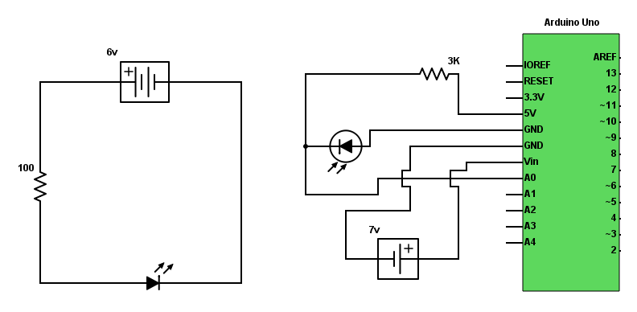

# Makerspace traffic detector

## Tools

1. Arduino Uno
2. UnaShield V2S
3. Infrared transmitter
4. Infrared photodiode
5. 3k ohm resistor
6. 100 ohm resistor
7. 4x AA Battery Holder
8. 7v Battery Holder
9. Jumper Wire
10. Breadboard/ Donut baord

## Schematics

